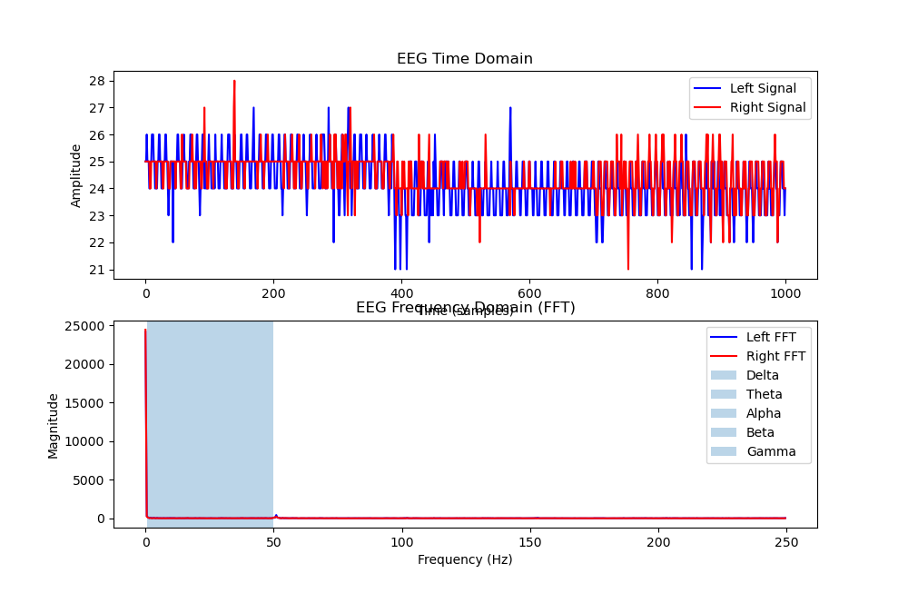
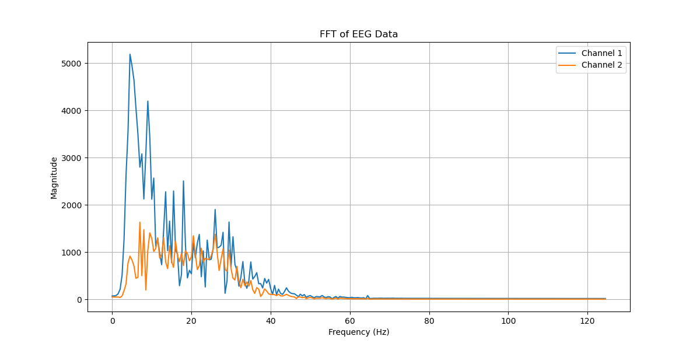

This is my entry for TECS

I was using pretty subpar hardware which meant I really had to support it with post processing in order to get anything that worked. 
( I am not yet familiar with Github, but I will try make this readable.)

**
WEEK 4 overview ** (earlier weeks are to be added.) 

I used 

