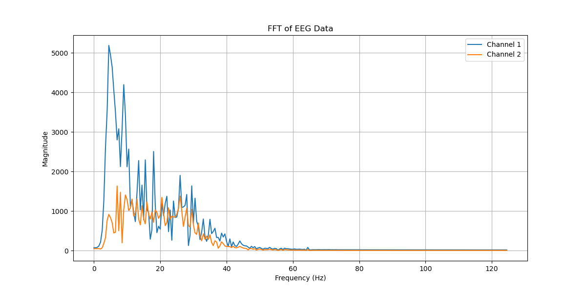

This is my entry for TECS

I was using pretty subpar hardware which meant I really had to support it with post processing in order to get anything that worked. 
( I am not yet familiar with Github, but I will try make this readable.)

# **WEEK 4 overview** (earlier weeks are to be added.) 

# A( bit of validation)

I compared the signals from an electrode that was connected to my friends forehead and one that was just rested on a table. 

The lower amplitudes and higher frequencies my just be noise, but the blinking activity was detected as being more than just the noise.
